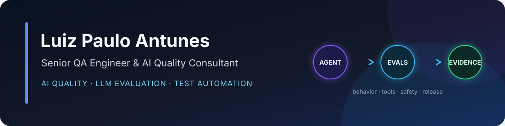

  

  
  
  

## Building evidence for reliable AI systems

I am a **Senior QA Engineer and AI Quality Consultant** with 10+ years of experience in software quality, test automation, and technical QA leadership.

My current focus is making AI-powered products observable and testable across the layers that matter: user journeys, APIs, contracts, agent behavior, tool usage, security boundaries, and release evidence.

### Selected projects

| Project | What it demonstrates |
| --- | --- |
| [**LLM Agent Evaluation Lab**](https://github.com/luizpaulo-antunes/llm-agent-evaluation-lab) | Versioned behavioral evaluation, safety checks, latency and cost signals, redacted observability, and repeatable CI. |
| [**Secure MCP Gateway Lab**](https://github.com/luizpaulo-antunes/secure-mcp-gateway-lab) | Authentication, least-privilege authorization, rate limiting, redacted audit events, and real MCP integration tests. |
| [**MCP Agent Quality Lab**](https://github.com/luizpaulo-antunes/mcp-agent-quality-lab) | API, contract, E2E, and behavioral testing for an agent that uses MCP tools, including grounding, privacy, and safe failures. |

### What I work on

- AI agent and LLM evaluation
- RAG quality, relevance, and groundedness testing
- MCP authentication, authorization, and tool-security validation
- Playwright and TypeScript test automation
- API, E2E, and OpenAPI contract testing
- Quality gates, observability, and traceable release evidence

### Core stack

`TypeScript` · `Playwright` · `Node.js` · `MCP` · `LLM Evals` · `RAG` · `OpenAPI` · `AJV` · `Allure` · `CI/CD`

### Work with me

I am available for focused quality assessments, test-automation projects, AI-agent and MCP security testing, and ongoing fractional Senior QA support.

For project inquiries, [contact me on LinkedIn](https://www.linkedin.com/in/luiz-paulo-antunes-43116a23/).

Public portfolio projects use synthetic data and contain no employer, customer, or production information.

